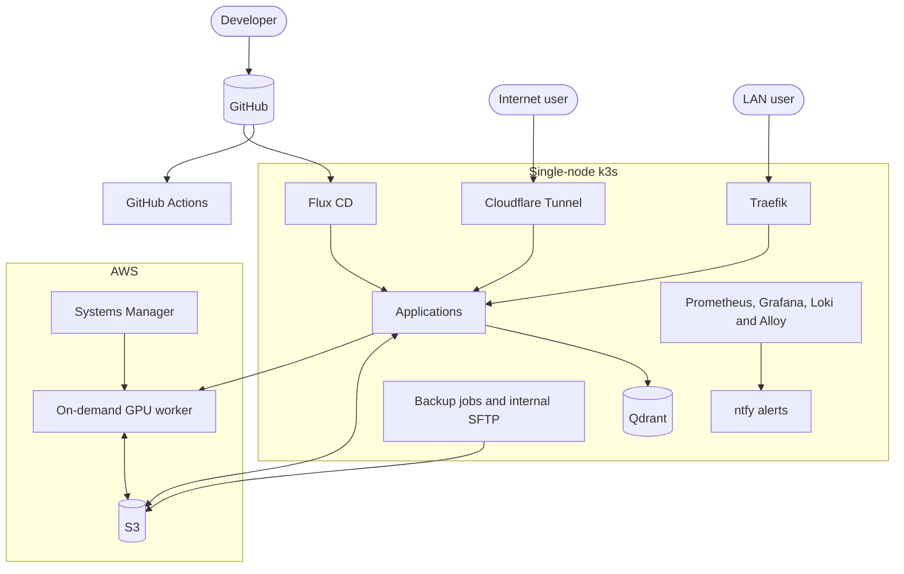

# homelab

A production-style GitOps homelab running on a repurposed laptop. Git is the source of truth for
the Kubernetes workloads and supporting AWS infrastructure; changes are validated in CI and
reconciled by Flux.

The main workload is [zgrzyt-ai](https://github.com/mikolajbielinski/zgrzyt-ai), a RAG system for
the Polish podcast ZGRZYT. Its [live demo](https://zgrzyt.mbielinski.com) runs in the cluster,
while GPU transcription is offloaded to AWS.

## Architecture



## Key engineering choices

- **GitOps delivery:** Flux applies Kustomize overlays and Helm releases only after changes reach
  `main`.
- **Encrypted configuration:** Kubernetes Secrets are stored in Git with SOPS and age and
  decrypted by Flux inside the cluster.
- **Controlled public access:** Cloudflare Tunnel exposes selected services without router port
  forwarding; internal services use Traefik and ClusterIP networking.
- **Observability:** Prometheus collects metrics, Grafana visualizes them, Loki stores logs and
  Alertmanager sends actionable notifications through ntfy.
- **Automated backups:** Linkding, Qdrant and k3s backups are created daily, retained locally and
  copied to a private S3 bucket.
- **Cost-aware cloud compute:** the GPU instance remains stopped until the zgrzyt-ai transcription
  queue contains work.
- **Reproducible updates:** application images are pinned by digest and Renovate proposes
  dependency, chart and image updates through pull requests.
- **Reduced attack surface:** workloads use scoped IAM permissions, hardened container security
  contexts and AWS Systems Manager instead of inbound SSH.

## Repository layout

```text
clusters/staging/              Flux entry point and reconciliation graph
apps/                          Application manifests and overlays
infrastructure/
  controllers/                 In-cluster platform services
  backups/                     Backup storage, SFTP and scheduled jobs
  terraform/                   AWS infrastructure
monitoring/
  controllers/                 Observability stack
  configs/                     Dashboards, alerts and encrypted configuration
docs/                          Design notes, audits and operational decisions
```

## Validation and delivery

GitHub Actions renders the complete Flux reconciliation graph, validates Kubernetes resources,
checks every Terraform project and scans secrets with SOPS-specific checks and gitleaks.

After merge, Renovate-managed image digests and Flux reconciliation provide a reviewed path from
source changes to the running cluster.
