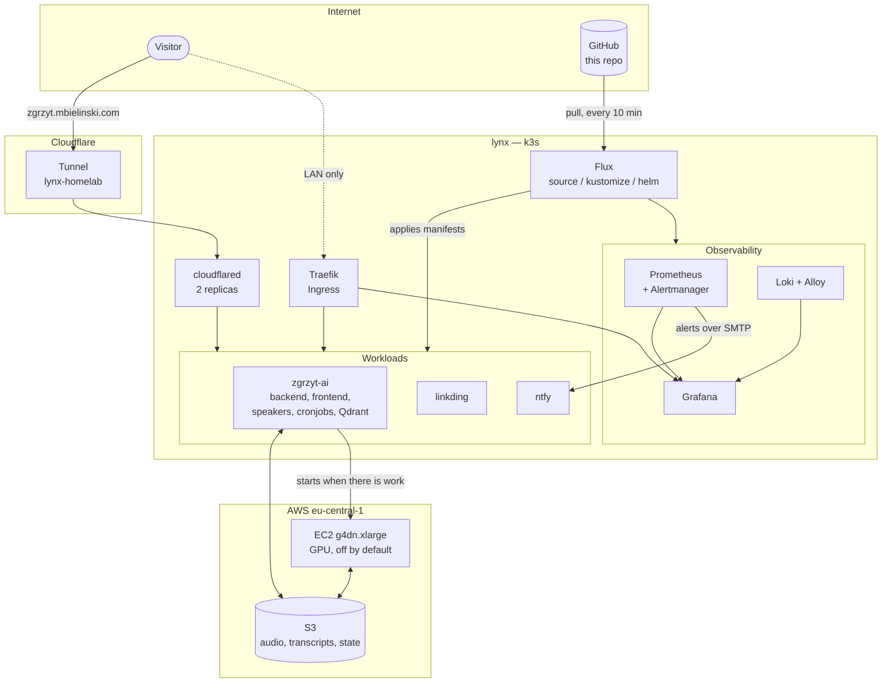

# homelab

A single-node Kubernetes cluster running on an old laptop in my flat. Everything above the
operating system is declared in this repository and applied by Flux — `kubectl apply` is not
part of the workflow, and a change reaches the cluster by being merged, not by being typed.

The main workload is [zgrzyt-ai](https://github.com/mikolajbielinski/zgrzyt-ai), a retrieval
chatbot over a Polish podcast. Most of the infrastructure here exists because that project
needed it.

## The machine

|  |  |
|---|---|
| Node | `lynx` — a retired laptop: 4 vCPU, 8 GB RAM, Ubuntu 24.04 LTS |
| Kubernetes | k3s v1.34.4, single node (control-plane and worker in one) |
| Storage | `local-path` provisioner — node-local directories, no network storage |
| GitOps | Flux CD, reconciling this repo every 10 minutes |
| Secrets | SOPS with an age key |
| Cloud | AWS, for the parts that need a GPU or durable storage |

## Architecture



Two ways in, for two different reasons. **Cloudflare Tunnel** serves the hostnames that need to
be reachable from outside — no port is forwarded on the home router and the flat's IP address
is never exposed. **Traefik** handles anything I only reach from the LAN. `cloudflared` runs
with two replicas because the tunnel is the single point of failure for everything public.

## What runs here

| Service | What it is | Manifests |
|---|---|---|
| **zgrzyt-ai** | RAG chatbot over a podcast: web UI, API, embedding and download jobs, Qdrant | `apps/base/zgrzyt-ai/` |
| **linkding** | Self-hosted bookmarks | `apps/base/linkding/` |
| **ntfy** | Push notifications to my phone — alert destination for the whole cluster | `infrastructure/controllers/base/ntfy/` |
| **cloudflared** | Cloudflare Tunnel daemon | `infrastructure/controllers/base/cloudflared/` |
| **Renovate** | Self-hosted dependency bot, runs as a CronJob at 06:00 | `infrastructure/controllers/base/renovate/` |
| **kube-prometheus-stack** | Prometheus, Alertmanager, Grafana, node-exporter, kube-state-metrics | `monitoring/controllers/base/kube-prometheus-stack/` |
| **Loki + Alloy** | Log aggregation; Alloy is a DaemonSet that ships pod logs to Loki | `monitoring/controllers/base/loki/` |

## Repository layout

```
clusters/staging/        Flux entry point — the Kustomization objects that define
                         what Flux deploys and from where
apps/                    Application workloads
infrastructure/          Shared infrastructure (tunnel, notifications, Renovate)
  controllers/           …deployed into the cluster
  terraform/             …and the parts that live in AWS
monitoring/
  controllers/           Helm releases for the observability stack
  configs/               Its configuration and secrets, reconciled separately
```

Everything under `apps/`, `infrastructure/controllers/` and `monitoring/` follows the same
`base/` + overlay split: `base/` holds the manifests, the overlay pins the namespace and adds
what is specific to this environment. With one environment the split buys little today; it
exists so that a second one is a directory, not a rewrite.

Flux watches four separate `Kustomization` objects rather than one. Monitoring is split into
`controllers` (the Helm releases) and `configs` (dashboards, Alertmanager routing, secrets)
because the second changes far more often than the first, and a broken dashboard should not
block a chart upgrade.

## Secrets

Secrets live in this repository, encrypted with [SOPS](https://github.com/getsops/sops) against
an age key that only exists on the node and on my laptop. `.sops.yaml` encrypts only the `data`
and `stringData` fields, so a diff still shows which keys changed and in which file — just not
their values.

Flux decrypts them at apply time using the `sops-age` secret in `flux-system`. Nothing is ever
created with `kubectl create secret`; if it is not in git, it does not exist.

Two consequences worth naming. Encrypted secrets sitting in git are safe but permanent — a leak
of the age key is retroactive, which is the argument for moving to short-lived credentials
eventually. And the AWS access keys used by the workloads do not expire, so rotation is a
manual step rather than something that happens on its own.

## Continuous integration

`.github/workflows/ci.yaml` runs on every pull request and on every push to `main`:

| Job | What it checks |
|---|---|
| `manifests` | `kustomize build` on every overlay, piped through `kubeconform -strict` |
| `terraform` | `terraform fmt -check -recursive` and `terraform validate` |
| `secrets` | gitleaks over the full history, plus a check that **every** `kind: Secret` in the repo contains a `sops:` block |

What CI deliberately does **not** check, because being explicit about the holes is more honest
than implying full coverage:

| Not checked | Why |
|---|---|
| Flux CRDs (`HelmRelease`, `Kustomization`, …) | no public JSON schemas, so `-ignore-missing-schemas` |
| Secret contents | SOPS adds a `sops:` key that is not in the schema, so `-skip Secret`; the `secrets` job covers them instead |
| Whether a secret actually decrypts | would require the age key in CI — intentionally not there |
| Whether an image tag exists in the registry | not wired up yet |
| `clusters/staging/` | plain `kustomize` cannot build it (no `kustomization.yaml` — Flux generates one at runtime). A typo in a `path:` here passes CI and fails in the cluster |

The `zgrzyt-ai` images and Cloudflared are pinned to immutable digests in the Kubernetes
manifests. The application images follow the moving `main` tag as `main@sha256:...`; Renovate
detects a new digest and opens a pull request, and Flux deploys it only after merge. Cloudflared
uses an explicit version together with a digest and is updated through the same review flow.

## Observability

Prometheus and Grafana come from `kube-prometheus-stack`; Loki stores logs in `SingleBinary`
mode on a local PVC with 168 hours of retention, and Alloy ships pod logs to it as a DaemonSet.
Grafana has both as datasources.

Alerts go to my phone through ntfy. Alertmanager sends them over **SMTP** to ntfy's built-in
mail server rather than through a webhook — `webhook_configs` sends a fixed JSON body with no
templating, which on a phone screen means 390 characters of `{"receiver":"ntfy","status":...}`.
`email_configs` has the full Go template engine, so the subject becomes the notification title
and the body becomes the message. No extra component involved.

The stack ships 243 rules and 149 alerts out of the box, which turned out to cover essentially
everything I would have written by hand. What was missing was not rules but a *receiver* —
Alertmanager had exactly one, named `null`. Three alerts are silenced permanently:
`KubeControllerManagerDown`, `KubeSchedulerDown` and `KubeProxyDown`, because on k3s those three
components run inside a single process and do not expose separate metrics. Standard rules do not
know that, and three permanent criticals is how you teach yourself to ignore alerts.

<!-- TODO(mikolaj): screenshot of the Grafana overview dashboard would go well right here -->

## AWS side

`infrastructure/terraform/zgrzyt-ai/` manages the parts of zgrzyt-ai that cannot live in the
flat: an S3 bucket that acts as the pipeline's state store, and a `g4dn.xlarge` GPU instance
that transcribes audio.

- **State** is remote, in a separate S3 bucket, with `use_lockfile = true` (S3-native locking,
  no DynamoDB table).
- **The GPU instance exists permanently but is stopped.** A CronJob in the cluster starts it
  when there is work and its own `user_data` shuts it down when the queue is empty. Two
  independent guards sit behind that: `instance_initiated_shutdown_behavior = "stop"` so a
  shutdown never destroys the machine, and a CloudWatch alarm that stops it after 45 minutes
  under 5% CPU in case the script never gets that far. A `shutdown -h +480` dead-man switch is
  armed in the first line of the script and cancelled only on a clean exit.
- **Terraform does not manage access keys.** `aws_iam_access_key` was removed from the code and
  the state, because the secret ended up in state as plaintext and Terraform kept reactivating
  keys I had deactivated by hand. Terraform owns the users and their policies; the key itself is
  created out of band with `aws iam create-access-key`.
- **The Hugging Face token lives in AWS Secrets Manager.** Terraform creates the
  `zgrzyt-ai/huggingface` secret and grants the EC2 role read access to that secret only;
  its value is populated outside Terraform. `user_data` contains only the secret ARN.
  The Python worker fetches `AWSCURRENT` through the instance role, using IMDSv2,
  and passes the token directly to the diarization library without exporting it or
  writing it to disk. Boot checks secret availability before processing the queue.
  Missing or malformed values and retrieval failures stop the job without marking
  audio files as failed; the shutdown trap still uploads diagnostics and stops EC2.
- **One IAM user per component**, each scoped to the prefixes it actually touches. None of them
  has `DeleteObject` on data, and none can see another's prefix. The policies were verified with
  `aws iam simulate-principal-policy` and then with real S3 calls, including the ones that are
  supposed to fail.

The fixed cost is about $8 a month for the 100 GiB EBS volume, which is billed whether the
instance runs or not; GPU time is on top of that and depends on how much there is to transcribe.
A budget alarm is set at $30 and fires at 85%, which leaves room for roughly 30 GPU hours.


## Known gaps

Things I know are missing or wrong.
- **No backups.** Every PVC is `local-path` on one node. Two of the four are recoverable by
  design (the podcast archive re-syncs from S3, Qdrant rebuilds from the transcripts), which was
  an architectural choice rather than luck — but linkding's database is not, and losing the disk
  loses it.
- **The overlay is called `staging` and it is production.** `zgrzyt.mbielinski.com` is public
  and costs real money. The name is a leftover.
- **The node itself is not in code.** Everything above k3s is reproducible; k3s and the OS
  underneath it were set up by hand.
- **Grafana's TLS certificate is self-signed and was uploaded manually.** It is the one resource
  in the cluster that does not come from git, and it expires in March 2027. cert-manager is the
  fix.
- **Flux failures do not notify anyone.** `notification-controller` runs, but no `Alert` or
  `Provider` is configured, so a stuck reconciliation is only visible if I go looking.
- **linkding is reachable under two different hostnames** through two different paths — an
  artefact of moving the tunnel into its own namespace.
- Most workloads have no liveness or readiness probes, and only the CronJobs declare resource
  requests.

## Running it

```bash
# see what Flux thinks the state is
flux get all -A

# force a reconcile instead of waiting out the 10 minute interval
flux reconcile kustomization apps --with-source

# decrypt a secret locally (needs the age key)
sops -d apps/base/zgrzyt-ai/openai-secret.yaml

# validate manifests the same way CI does
kustomize build apps/staging | kubeconform -strict -ignore-missing-schemas -skip Secret
```
